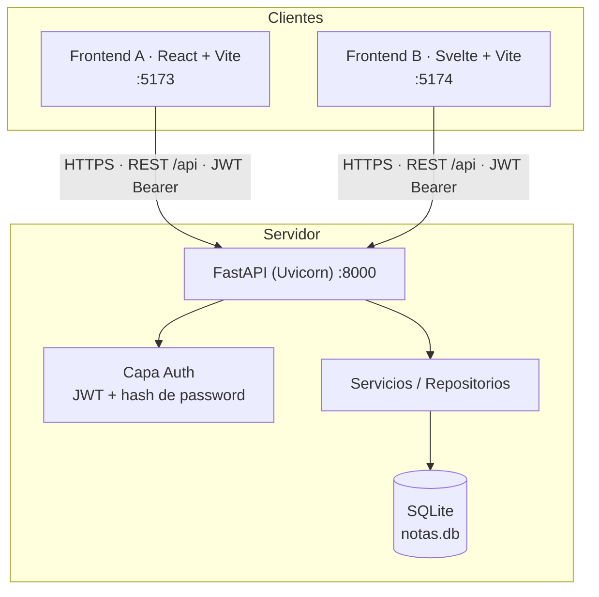
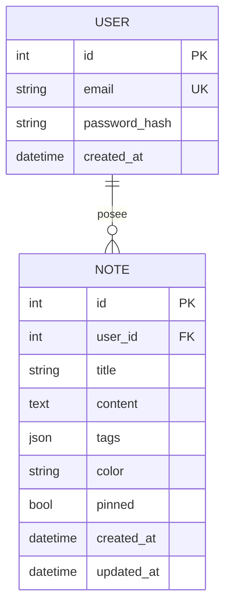
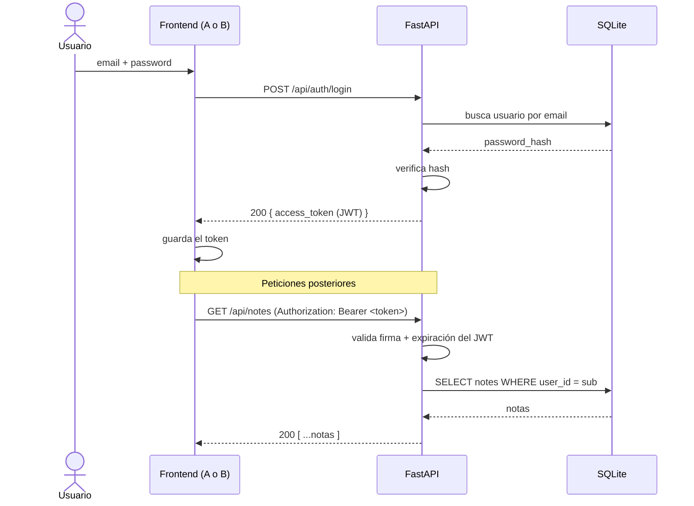

# 🏛️ Arquitectura — Notas

Este documento describe la arquitectura técnica de **Notas**: la estructura del sistema, el modelo de datos, el flujo de autenticación, las decisiones de diseño (ADRs) y las consideraciones de seguridad y escalabilidad.

---

## 1. Visión general

Notas es un **monorepo** con un backend único que expone una API REST y **dos frontends** que la consumen de forma intercambiable (estrategia A/B entre React y Svelte).



### Diagrama ASCII (alternativo)

```
   ┌────────────────┐     ┌────────────────┐
   │  Frontend A     │     │  Frontend B     │
   │  React  :5173   │     │  Svelte :5174   │
   └───────┬─────────┘     └────────┬────────┘
           │   REST /api · JWT       │
           └───────────┬────────────┘
                       ▼
            ┌────────────────────────┐
            │   FastAPI  (Uvicorn)    │
            │ ┌────────┐ ┌──────────┐ │
            │ │  Auth  │ │ Servicios│ │
            │ │  JWT   │ │  /Repos  │ │
            │ └────────┘ └────┬─────┘ │
            └─────────────────┼───────┘
                              ▼
                     ┌────────────────┐
                     │  SQLite (.db)   │
                     └────────────────┘
```

---

## 2. Componentes

| Componente      | Responsabilidad                                                        |
| --------------- | --------------------------------------------------------------------- |
| **FastAPI**     | Enrutado, validación (Pydantic), serialización, OpenAPI automático.    |
| **Capa Auth**   | Hash de contraseñas, emisión y verificación de JWT, dependencia `get_current_user`. |
| **Servicios/Repos** | Lógica de negocio y acceso a datos; aíslan la API de la persistencia. |
| **SQLite**      | Almacenamiento relacional ligero. Reemplazable por Postgres en v2.     |
| **Frontends**   | SPA que consumen la misma API. Guardan el JWT y renderizan la UI.      |

---

## 3. Modelo de datos

### Entidades



### Tabla `users`

| Campo            | Tipo       | Notas                          |
| ---------------- | ---------- | ------------------------------ |
| `id`             | INTEGER PK | Autoincremental                |
| `email`          | TEXT       | Único, indexado                |
| `password_hash`  | TEXT       | Hash (bcrypt/argon2), nunca texto plano |
| `created_at`     | DATETIME   | UTC                            |

### Tabla `notes`

| Campo         | Tipo       | Notas                                   |
| ------------- | ---------- | --------------------------------------- |
| `id`          | INTEGER PK | Autoincremental                         |
| `user_id`     | INTEGER FK | → `users.id`, indexado                  |
| `title`       | TEXT       | Título de la nota                       |
| `content`     | TEXT       | Cuerpo (texto/markdown)                 |
| `tags`        | JSON/TEXT  | Array de strings, ej. `["trabajo"]`     |
| `color`       | TEXT       | Color de la tarjeta (hex o nombre)      |
| `pinned`      | BOOLEAN    | Nota fijada                             |
| `created_at`  | DATETIME   | UTC                                     |
| `updated_at`  | DATETIME   | UTC, se actualiza en cada PUT           |

**Representación JSON de una nota:**

```json
{
  "id": 42,
  "title": "Lista de compras",
  "content": "Leche, pan, café",
  "tags": ["personal", "casa"],
  "color": "#FFD966",
  "pinned": true,
  "created_at": "2026-06-17T10:00:00Z",
  "updated_at": "2026-06-17T11:30:00Z"
}
```

---

## 4. API REST

Todas las rutas viven bajo el prefijo `/api`. Las rutas de notas requieren `Authorization: Bearer <token>`.

| Método   | Endpoint              | Auth | Cuerpo / Notas                                    |
| -------- | --------------------- | :--: | ------------------------------------------------- |
| `POST`   | `/api/auth/register`  |  No  | `{ email, password }` → crea usuario              |
| `POST`   | `/api/auth/login`     |  No  | `{ email, password }` → `{ access_token, token_type }` |
| `GET`    | `/api/auth/me`        |  Sí  | Devuelve el usuario autenticado                   |
| `GET`    | `/api/notes`          |  Sí  | Lista las notas del usuario                       |
| `POST`   | `/api/notes`          |  Sí  | Crea una nota                                     |
| `GET`    | `/api/notes/{id}`     |  Sí  | Obtiene una nota (debe pertenecer al usuario)     |
| `PUT`    | `/api/notes/{id}`     |  Sí  | Actualiza una nota                                |
| `DELETE` | `/api/notes/{id}`     |  Sí  | Elimina una nota                                  |

Cada usuario solo puede acceder a sus propias notas: las rutas filtran por `user_id` del token (ownership enforcement).

---

## 5. Flujo de autenticación (JWT)



1. **Registro:** la contraseña se hashea antes de guardarse; nunca se almacena en texto plano.
2. **Login:** se verifica el hash y se emite un JWT firmado (HS256) con `sub` (id de usuario) y `exp`.
3. **Acceso:** la dependencia `get_current_user` valida firma y expiración en cada request protegido.
4. **Expiración:** tokens de corta duración; la renovación (refresh tokens) está en el roadmap (v2).

---

## 6. Decisiones de arquitectura (ADRs)

> Formato breve: contexto → decisión → consecuencias.

### ADR-001 · Monorepo
- **Contexto:** un backend y dos frontends que evolucionan juntos.
- **Decisión:** mantener todo en un único repositorio con carpetas `backend/`, `frontend/`, `frontend-alt/`.
- **Consecuencias:** ✅ versionado y CI unificados, cambios atómicos de contrato API+UI. ⚠️ requiere CI con jobs por carpeta.

### ADR-002 · FastAPI como backend
- **Decisión:** usar FastAPI por su tipado con Pydantic, rendimiento async y OpenAPI automático.
- **Consecuencias:** ✅ documentación y validación gratis, DX excelente. ⚠️ ecosistema más joven que Django.

### ADR-003 · SQLite para el MVP
- **Decisión:** empezar con SQLite (cero infraestructura).
- **Consecuencias:** ✅ simple, rápido para desarrollar y testear. ⚠️ concurrencia de escritura limitada → migrar a Postgres en v2 (ADR-006).

### ADR-004 · JWT stateless
- **Decisión:** autenticación con JWT Bearer sin estado de sesión en servidor.
- **Consecuencias:** ✅ escala horizontalmente sin sesiones compartidas. ⚠️ la revocación inmediata es difícil → refresh tokens + lista de revocación en v2.

### ADR-005 · Dos frontends para A/B
- **Decisión:** construir Versión A (React) y Versión B (Svelte) sobre la misma API.
- **Consecuencias:** ✅ comparación real de DX, rendimiento y feedback de usuarios. ⚠️ doble esfuerzo de mantenimiento durante el experimento.

### ADR-006 · Camino de migración a Postgres (futuro)
- **Decisión:** aislar el acceso a datos en una capa de repositorios para facilitar el cambio de motor.
- **Consecuencias:** ✅ migración con bajo acoplamiento. ⚠️ ligera capa de indirección extra.

---

## 7. Seguridad

- 🔑 **Contraseñas:** almacenadas como hash (bcrypt/argon2), nunca en texto plano.
- 🧾 **JWT:** firmados con `SECRET_KEY` fuerte (variable de entorno, fuera del código). Expiración corta.
- 🛡️ **Autorización por recurso:** cada query de notas filtra por `user_id`; un usuario no puede leer notas ajenas.
- 🌐 **CORS:** orígenes permitidos restringidos a los puertos de los frontends (`5173`, `5174`).
- ✅ **Validación de entrada:** Pydantic valida y sanea todos los payloads.
- 🚦 **Rate limiting:** previsto para auth (anti fuerza bruta) — ver roadmap.
- 🔒 **HTTPS:** obligatorio en producción (terminación TLS en el reverse proxy).
- 🤐 **Secretos:** se usan `.env` (ignorados por git); solo se versiona `.env.example`.

---

## 8. Escalabilidad y sincronización

- **Escalado horizontal:** al ser stateless (JWT), la API se puede replicar tras un balanceador.
- **Base de datos:** SQLite cubre el MVP; el camino de crecimiento es Postgres con un pool de conexiones.
- **Sincronización entre dispositivos:** el servidor es la fuente de verdad. Cada nota lleva `updated_at` (UTC) para resolución de conflictos *last-write-wins* en una primera fase.
- **Offline / PWA (v2):** caché local + cola de cambios pendientes que se reconcilian al volver la conexión, usando `updated_at` para detectar conflictos.
- **Colaboración en tiempo real (v2+):** evolución hacia WebSockets/CRDT si se requiere edición concurrente.
- **Caché:** ETag/`If-None-Match` en `GET /api/notes` para reducir transferencia.

---

## 9. Referencias

- [DESIGN.md](DESIGN.md) — sistema de diseño y estrategia A/B.
- [ROADMAP.md](ROADMAP.md) — fases y features.
- [README](../README.md) — quickstart y stack.
